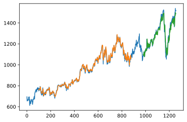

# Stock Market Prediction and Forecasting
> By Parth Mistry

* This is a stock market prediction and forecasting model.  
* It uses the ```Tiingo API``` from ```Pandas DataReader```.  
* Here we will be gathering stock data of ```GOOGL``` which is in  ```NASDAQ```.
* The data is from 22nd July'15 uptill 17th July'20 which is 1257 days.  
* Used Stacked LSTM and word embedding for model training.

---

## Code and Resources Used 
**Python Version:** 3.7  
**Packages:** pandas, pandas_data_reader, numpy, matplotlib, tensorflow  
**Tensorflow Version:** 2.3.0 (GPU Support)

---

## Collecting Data

* As here we are using real time data, there is no coneventional dataset for it.
* We can collect the that real time data using various API services.
* Just by using those API calls we can get the data of any stock we want just by passing it's name in the API call.
* For that, we will use Tiingo API as it has support in the Pandas Data Reader library.
* Reference to the API Call : [Click here](https://pandas-datareader.readthedocs.io/en/latest/readers/tiingo.html)
* You will need an API key to get the data from the provider. The API key can be obtained from [here](https://www.tiingo.com/data/api).

---
## Exploring Data

* The data received from the call will have 14 columns  
    * Symbol
    * Date
    * Close
    * High
    * Low
    * Open
    * Vol
    * AjdClose
    * AjdHigh
    * AjdLow
    * AjdOpen
    * AdjVol
    * divCash
    * Split Factor

* This is how the closing values look:    


---
## Model Archietecture
* In this step, we will design and implement a deep learning model that learns patterns from the data.
* For this problem statement we will use Stacked LSTM to predict the future values. The reason behind choosing Long Short Term Memory is because it will remember the previous data patterns and will take the further decisions according to that. Whenever there is a senario where the previous weights/features can help to optimize the output, we can use LSTM to do that for us.  
* The training and testing split will also be different from the normal machine learning and deep learning practices where we generally use ```train_test_split``` from ```Scikit Learn```.
* ```train_test_split``` will create 2 parts each of labels and features randomly. If that is done here, than the previous data will be lost and LSTM will not be a single bit efficient to predict.
* So here we have to create our own function which will help us to split data in order and not randomly.
```
def create_dataset(dataset,time_step=1):
    dataX, dataY = [], []
    for i in range(len(dataset)-time_step-1):
        a = dataset[i:(i+time_step),0]
        dataX.append(a)
        dataY.append(dataset[i+time_step,0])
    return numpy.array(dataX),numpy.array(dataY)
```
* The neural network follows these steps:
    Input => LSTM => LSTM => LSTM => Dense
* We minimize the loss function using the Adaptive Moment Estimation (Adam) Algorithm. Adam is an optimization algorithm introduced by D. Kingma and J. Lei Ba in a 2015 paper named Adam: A Method for Stochastic Optimization. Adam algorithm computes adaptive learning rates for each parameter. In addition to storing an exponentially decaying average of past squared gradients like Adadelta and RMSprop algorithms, Adam also keeps an exponentially decaying average of past gradients mtmt, similar to momentum algorithm, which in turn produce better results.
* We will use ```mean squared error``` as the loss function.

---
## Training and Evaluation

* After each epoch, we measure the loss and accuracy of the validation set
* And after training, we will save the model.
* A low accuracy on the training and validation sets imply underfitting. A high accuracy on the training set but low accuracy on the validation set implies overfitting.

```
Epoch 1/100   loss: 0.0440 - val_loss: 0.0533
Epoch 2/100   loss: 0.0077 - val_loss: 0.0089
Epoch 3/100   loss: 0.0033 - val_loss: 0.0128
Epoch 4/100   loss: 0.0016 - val_loss: 0.0090
Epoch 5/100   loss: 0.0015 - val_loss: 0.0089
Epoch 6/100   loss: 0.0014 - val_loss: 0.0079
Epoch 7/100   loss: 0.0014 - val_loss: 0.0080
Epoch 8/100   loss: 0.0014 - val_loss: 0.0082
Epoch 9/100   loss: 0.0014 - val_loss: 0.0085
Epoch 10/100  loss: 0.0014 - val_loss: 0.0076
Epoch 11/100  loss: 0.0013 - val_loss: 0.0079
Epoch 12/100  loss: 0.0013 - val_loss: 0.0086
Epoch 13/100  loss: 0.0013 - val_loss: 0.0094
Epoch 14/100  loss: 0.0014 - val_loss: 0.0065
Epoch 15/100  loss: 0.0013 - val_loss: 0.0059
Epoch 16/100  loss: 0.0013 - val_loss: 0.0086
Epoch 17/100  loss: 0.0013 - val_loss: 0.0064
Epoch 18/100  loss: 0.0013 - val_loss: 0.0065
Epoch 19/100  loss: 0.0012 - val_loss: 0.0076
Epoch 20/100  loss: 0.0012 - val_loss: 0.0085
Epoch 21/100  loss: 0.0011 - val_loss: 0.0052
Epoch 22/100  loss: 0.0012 - val_loss: 0.0055
Epoch 23/100  loss: 0.0011 - val_loss: 0.0040
Epoch 24/100  loss: 0.0012 - val_loss: 0.0102
Epoch 25/100  loss: 0.0012 - val_loss: 0.0049
Epoch 26/100  loss: 0.0011 - val_loss: 0.0075
Epoch 27/100  loss: 0.0013 - val_loss: 0.0058
Epoch 28/100  loss: 0.0010 - val_loss: 0.0048
Epoch 29/100  loss: 9.9390e-04 - val_loss: 0.0081
Epoch 30/100  loss: 0.0013 - val_loss: 0.0052
Epoch 31/100  loss: 9.9397e-04 - val_loss: 0.0040
Epoch 32/100  loss: 0.0010 - val_loss: 0.0047
Epoch 33/100  loss: 9.4617e-04 - val_loss: 0.0030
Epoch 34/100  loss: 9.5729e-04 - val_loss: 0.0076
Epoch 35/100  loss: 0.0011 - val_loss: 0.0035
Epoch 36/100  loss: 9.6878e-04 - val_loss: 0.0063
Epoch 37/100  loss: 9.5295e-04 - val_loss: 0.0026
Epoch 38/100  loss: 9.8058e-04 - val_loss: 0.0051
Epoch 39/100  loss: 0.0010 - val_loss: 0.0039
Epoch 40/100  loss: 7.9136e-04 - val_loss: 0.0031
Epoch 41/100  loss: 7.2678e-04 - val_loss: 0.0031
Epoch 42/100  loss: 6.9039e-04 - val_loss: 0.0038
Epoch 43/100  loss: 7.0575e-04 - val_loss: 0.0024
Epoch 44/100  loss: 6.6472e-04 - val_loss: 0.0046
Epoch 45/100  loss: 6.8228e-04 - val_loss: 0.0019
Epoch 46/100  loss: 7.0627e-04 - val_loss: 0.0048
Epoch 47/100  loss: 6.4621e-04 - val_loss: 0.0019
Epoch 48/100  loss: 5.9996e-04 - val_loss: 0.0038
Epoch 49/100  loss: 6.0810e-04 - val_loss: 0.0021
Epoch 50/100  loss: 6.1804e-04 - val_loss: 0.0036
Epoch 51/100  loss: 5.9258e-04 - val_loss: 0.0018
Epoch 52/100  loss: 5.4509e-04 - val_loss: 0.0020
Epoch 53/100  loss: 5.6683e-04 - val_loss: 0.0015
Epoch 54/100  loss: 5.7567e-04 - val_loss: 0.0047
Epoch 55/100  loss: 5.2916e-04 - val_loss: 0.0018
Epoch 56/100  loss: 4.8154e-04 - val_loss: 0.0014
Epoch 57/100  loss: 4.8149e-04 - val_loss: 0.0020
Epoch 58/100  loss: 4.5128e-04 - val_loss: 0.0021
Epoch 59/100  loss: 4.3894e-04 - val_loss: 0.0025
Epoch 60/100  loss: 4.7022e-04 - val_loss: 0.0029
Epoch 61/100  loss: 4.8122e-04 - val_loss: 0.0021
Epoch 62/100  loss: 4.4237e-04 - val_loss: 0.0016
Epoch 63/100  loss: 4.6114e-04 - val_loss: 0.0034
Epoch 64/100  loss: 4.2806e-04 - val_loss: 0.0037
Epoch 65/100  loss: 5.0520e-04 - val_loss: 0.0019
Epoch 66/100  loss: 4.4204e-04 - val_loss: 0.0011
Epoch 67/100  loss: 4.2561e-04 - val_loss: 0.0012
Epoch 68/100  loss: 4.2504e-04 - val_loss: 0.0014
Epoch 69/100  loss: 3.9213e-04 - val_loss: 0.0017
Epoch 70/100  loss: 3.7592e-04 - val_loss: 0.0014
Epoch 71/100  loss: 3.9512e-04 - val_loss: 0.0012
Epoch 72/100  loss: 5.1155e-04 - val_loss: 0.0021
Epoch 73/100  loss: 4.2125e-04 - val_loss: 0.0013
Epoch 74/100  loss: 4.0624e-04 - val_loss: 0.0012
Epoch 75/100  loss: 3.9191e-04 - val_loss: 0.0031
Epoch 76/100  loss: 4.2183e-04 - val_loss: 0.0024
Epoch 77/100  loss: 3.5716e-04 - val_loss: 0.0010
Epoch 78/100  loss: 4.4583e-04 - val_loss: 0.0024
Epoch 79/100  loss: 3.6618e-04 - val_loss: 0.0017
Epoch 80/100  loss: 3.5807e-04 - val_loss: 0.0025
Epoch 81/100  loss: 3.8270e-04 - val_loss: 0.0032
Epoch 82/100  loss: 4.1191e-04 - val_loss: 0.0016
Epoch 83/100  loss: 3.3797e-04 - val_loss: 0.0013
Epoch 84/100  loss: 3.6970e-04 - val_loss: 0.0023
Epoch 85/100  loss: 3.6150e-04 - val_loss: 0.0015
Epoch 86/100  loss: 3.5194e-04 - val_loss: 0.0012
Epoch 87/100  loss: 3.3090e-04 - val_loss: 0.0011
Epoch 88/100  loss: 4.9265e-04 - val_loss: 0.0013
Epoch 89/100  loss: 3.4993e-04 - val_loss: 0.0011
Epoch 90/100  loss: 3.2971e-04 - val_loss: 0.0016
Epoch 91/100  loss: 3.5713e-04 - val_loss: 0.0023
Epoch 92/100  loss: 3.9295e-04 - val_loss: 0.0019
Epoch 93/100  loss: 3.1612e-04 - val_loss: 0.0012
Epoch 94/100  loss: 3.1225e-04 - val_loss: 0.0015
Epoch 95/100  loss: 3.0692e-04 - val_loss: 0.0018
Epoch 96/100  loss: 3.4339e-04 - val_loss: 0.0016
Epoch 97/100  loss: 3.1938e-04 - val_loss: 0.0028
Epoch 98/100  loss: 4.1740e-04 - val_loss: 9.8393e-04
Epoch 99/100  loss: 3.2889e-04 - val_loss: 0.0012
Epoch 100/100 loss: 3.3640e-04 - val_loss: 9.9860e-04
```
* The prediction of our model on the test case was quite similar as the closing numbers were in the real world senario.
* The following graph shows that the orange part is the training data and green part is the tested prediction. It is on the blue line which is the original dataset.  


* So from this we can conclude that the prediction done by the model was pretty accurate.

---
## Conclusion
* Using this model, we were able to reach a proper accuracy compared to real world data. We can try other processing techniques to further improve the model and implement it in the real world senario.

Parth Mistry © 2020